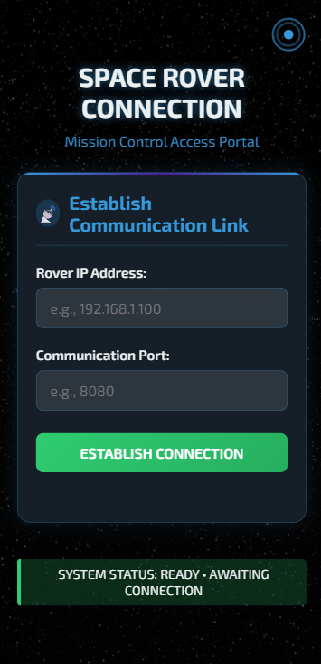
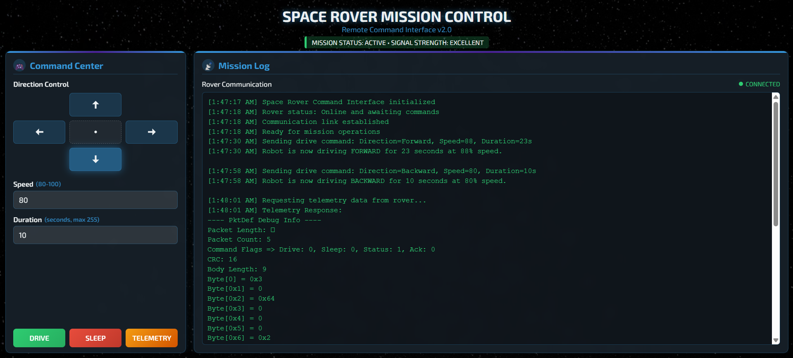

# Robot Controller Web Server

## 📌 Project Overview

This project implements a simple web server using the Crow C++ microframework to interact with a robot simulator over UDP/TCP. The server:

- Sends control commands (drive, sleep) to the robot
- Requests telemetry data
- Serves static HTML pages for the user interface
- Exposes RESTful endpoints for telecommands and telemetry

---

## 👥 Team

**Group 2**

- Rishi Umaria
- Tyler Phillips

---

## 📁 Folder Structure

```
robot_controller/
├── Milestone1/
│   └── PktDef.cpp, PktDef.h     # Packet format, CRC, serialization, deserialization
├── Milestone2/
│   └── MySocket.cpp, MySocket.h # TCP/UDP socket wrappers, send/receive logic
└── Milestone3/
    ├── build/                   # CMake build directory
    ├── public/
    │   ├── index.html           # Landing page
    │   └── command.html         # Command UI
    ├── main.cpp                 # Crow-based web server
    └── CMakeLists.txt
```

---

## 🛠️ Prerequisites

- Docker (Linux container support enabled)
- C++ build tools inside the Docker container:
  - `g++`
  - `cmake`
  - `make`

---

## 🐳 Building & Running in Docker

### 1. Launch Docker Container

```bash
docker run -ti \
  -p 23500:23500 \
  -v "<path>/:/mnt/robot_controller" \
  webserver_dev_updated bash
```
> This mounts your project folder to `/mnt/robot_controller` in the container.

---

### 2. Install Build Tools Inside Container

```bash
apt-get update && \
apt-get install -y g++ cmake make
```

---

### 3. Build & Run the Web Server

```bash
cd /mnt/robot_controller/Milestone3/build
cmake .. && make
./Milestone3
```

---

## 🌐 Accessing the Web UI

Open your browser and go to:

```
http://<docker-host-ip>:23500/
```

- **Landing Page:** `/`
- **Command UI:** `/command.html`

Login & Dashboard UI  
[](LoginUI.png)  
[](home_control.png)
---

## 📡 REST API Endpoints

| Endpoint                                 | Method | Description                   |
|-------------------------------------------|--------|-------------------------------|
| `/connect/<IP>/<port>`                    | POST   | Connect to the robot simulator|
| `/telecommand/`                           | PUT    | Send "sleep" command          |
| `/telecommand/<direction>/<duration>/<speed>` | PUT | Send "drive" command          |
| `/telemetry_request/`                     | GET    | Request telemetry data         |

---

## 📝 Notes

- Ensure your robot simulator (`/robot`) is running and reachable at the IP/port you provide in the `/connect/` request.
- The Docker container maps host port **23500** to the Crow web server inside the container.
- Static HTML files (`index.html`, `command.html`) are served from the `public/` directory.
- Packet formatting and socket logic reside in `Milestone1/` and `Milestone2/`.

---
